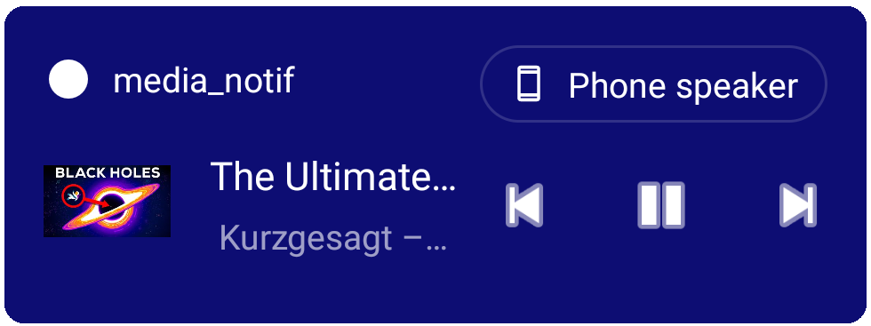
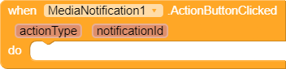
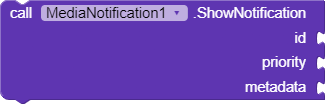
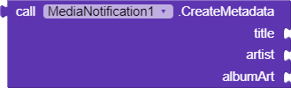
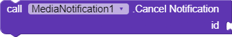
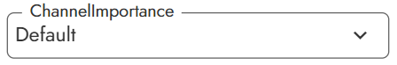

# Media Notifications

An MIT AI2 extension to allows developers to show media style notifications for their applications.

<br>
<p align='center'>

</p>

<p align='center'>
<em>A media style notification on Android 11 shown using Media Notification extension</em>
</p>

## Usage
* Download the extension from the latest [release](https://github.com/ShreyashSaitwal/media-notification/releases/latest).<br>
  **Note**: If you're a Kodular user, download the AIX file who's name ends with `.support.aix`.
* Import the extension in the builder (AI2, Kodular, etc).
* Play around with the blocks provided by the extension. For more info about what each block does, check out the block reference below.


## Block reference

* ### Events

  * **ActionButtonClicked**

    Fires when one of the action button on the notification is clicked.

    

    Param | Description
    --- | --
    `actionType` | The type of the action button that was clicked. It could be one of the following:<br> 1. **play**<br> 2. **pause**<br> 3. **next**<br> 4. **previous**

* ### Methods

  * **ShowNotification**

    

    Shows a media style notification.

    Param | Description
    --- | ---
    `id` | A unique integer that identifies this notification.
    `priority` | The relative priority for this notification. Priority is an indication of how much of the user's valuable attention should be consumed by this notification.
    `metadata` | The metadata for some media.

  * **CreateMetadata**

    

    Creates and returns a metadata object for some media.

    Param | Description
    --- | ---
    `title` | The title of the media.
    `artist` | The artist for the album of the media's original source.
    `albumArt` | The artwork for the album of the media's original source. It can be an URL to a remote image or an image from assets.

    > **Note**: If you use a remote image, make sure it's not too big. Large images may fail to load and the notification won't be shown.

    <br>

  * **CancelNotification**

    

    Cancels the notification with the given ID.
    ‎
    Param | Description
    --- | ---
    `id` | A unique integer that identifies the notification that is to be canceled.

  * **CancelAll**

    

    Cancels all the previously shown notifications.


* ### Properties

  * **ChannelID**

    

    **`Getter + Setter`**

    Specifies the channel the notification should be delivered on.

  * **ChannelImportance**

    

    **`Getter + Setter`**

    Specifies the importance of the channel the notifications are being delivered on.

  * **ChannelID**

    

    **`Getter + Setter`**

    Specifies the name of channel the notification should be delivered on.

  * **NotificationPriorities**

    * 

      Default notification priority. If your application does not prioritize its own notifications, use this value for all notifications.

    * 

      Higher notification priority, for more important notifications or alerts. The UI may choose to show these items larger, or at a different position in notification lists, compared with your app's PriorityDefault items.

    * 

      Lower notification priority, for items that are less important. The UI may choose to show these items smaller, or at a different position in the list, compared with your app's PriorityDefault items.

    * 

      Highest notification priority, for your application's most important items that require the user's prompt attention or input.

    * 

      Lowest notification priority; these items might not be shown to the user except under special circumstances, such as detailed notification logs.


## License
```
MIT License

Copyright (c) 2021 Shreyash Saitwal

Permission is hereby granted, free of charge, to any person obtaining a copy
of this software and associated documentation files (the "Software"), to deal
in the Software without restriction, including without limitation the rights
to use, copy, modify, merge, publish, distribute, sublicense, and/or sell
copies of the Software, and to permit persons to whom the Software is
furnished to do so, subject to the following conditions:

The above copyright notice and this permission notice shall be included in all
copies or substantial portions of the Software.

THE SOFTWARE IS PROVIDED "AS IS", WITHOUT WARRANTY OF ANY KIND, EXPRESS OR
IMPLIED, INCLUDING BUT NOT LIMITED TO THE WARRANTIES OF MERCHANTABILITY,
FITNESS FOR A PARTICULAR PURPOSE AND NONINFRINGEMENT. IN NO EVENT SHALL THE
AUTHORS OR COPYRIGHT HOLDERS BE LIABLE FOR ANY CLAIM, DAMAGES OR OTHER
LIABILITY, WHETHER IN AN ACTION OF CONTRACT, TORT OR OTHERWISE, ARISING FROM,
OUT OF OR IN CONNECTION WITH THE SOFTWARE OR THE USE OR OTHER DEALINGS IN THE
SOFTWARE.
```
